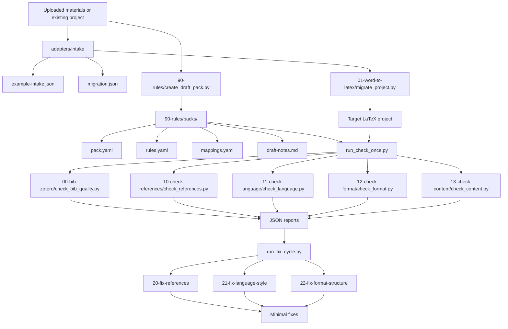

# Thesis Skills

`Thesis Skills` is a `Python + Skills` workflow repository for thesis writing, journal submission, template onboarding, and Word-to-LaTeX migration.

It is not just a prompt collection. It is an executable, testable, reusable pipeline for turning academic writing rules into deterministic checks, report-driven fixes, and reusable rule packs.

## Table of Contents

- [Overview](#overview)
- [Why This Project Exists](#why-this-project-exists)
- [Advantages](#advantages)
- [Technical Roadmap](#technical-roadmap)
- [Repository Layout](#repository-layout)
- [Quick Start](#quick-start)
- [Enhanced Intake Schema](#enhanced-intake-schema)
- [Adapting Other Universities and Journals](#adapting-other-universities-and-journals)
- [Template Links](#template-links)
- [Detailed Architecture Doc](#detailed-architecture-doc)
- [Current Status](#current-status)

## Overview

`thesis-skills` focuses on the parts of academic writing that are repetitive, error-prone, and highly suitable for structured automation.

It gives you:

- `Word -> LaTeX` migration helpers
- deterministic checkers for references, language, format, and content structure
- safe fixers driven by JSON reports instead of freeform rewriting
- YAML rule packs for universities and journals
- draft-pack scaffolding from uploaded-material metadata

This means the repository is best understood as:

- a migration assistant
- a template onboarding toolkit
- a thesis/journal quality gate
- an AI + Python collaboration layer for academic writing workflows

## Why This Project Exists

Most AI writing helpers stop at prompting. That works for brainstorming, but it breaks down when users need stable, repeatable results across templates, schools, journals, and long writing cycles.

This repository exists to separate concerns clearly:

1. Python handles deterministic scanning, file discovery, and report generation.
2. Skills handle orchestration, explanation, and selective human-in-the-loop edits.
3. Rule packs hold school- and journal-specific requirements in reusable form.

Instead of asking a model to "remember the whole thesis style guide," you codify what can be codified and let AI help only where AI is actually useful.

## Advantages

### 1. Executable workflow, not just prompts

The main loop is real code: `run_check_once.py`, `run_fix_cycle.py`, deterministic checkers, and reusable packs. That makes behavior more stable and easier to verify.

### 2. AI and deterministic logic are split cleanly

- Python does scanning, matching, rule evaluation, and report output.
- Skills and AI help with interpretation, migration decisions, and minimal edits.

That reduces hallucination while preserving flexibility.

### 3. Built for reuse beyond one school

The current starters already include:

- `tsinghua-thesis`
- `university-generic`
- `journal-generic`

So the architecture is already prepared for other universities, departments, and journals.

### 4. Migration and policy are separate layers

`01-word-to-latex` moves assets into a project. `90-rules` defines policy. `run_check_once.py` and `run_fix_cycle.py` consume project state plus rules. This separation keeps the system understandable and extensible.

### 5. Beginner-friendly without sacrificing engineering quality

Users can start with one-click commands, while contributors still get a modular repository with tests, core utilities, starter packs, and explicit contracts.

## Technical Roadmap



In plain terms:

1. Gather materials or point the tool at an existing LaTeX project.
2. Use intake metadata to drive migration and draft rule-pack generation.
3. Run deterministic checks to produce machine-readable reports.
4. Run safe fixers against those reports.
5. Iterate until the project matches the selected ruleset.

## Repository Layout

```text
thesis-skills/
├── 00-bib-zotero/              # Zotero bibliography intake checks
├── 00-bib-endnote/             # EndNote bibliography workflow docs
├── 01-word-to-latex/           # Word -> LaTeX migration entrypoint
├── 10-check-references/        # Citation integrity checks
├── 11-check-language/          # Language and spacing checks
├── 12-check-format/            # Figure/table/ref/format checks
├── 13-check-content/           # Content structure checks
├── 20-fix-references/          # Report-driven reference fixes
├── 21-fix-language-style/      # Report-driven language fixes
├── 22-fix-format-structure/    # Report-driven format fixes
├── 90-rules/                   # Rulesets and pack generators
├── 99-runner/                  # Runner documentation
├── adapters/intake/            # User-provided intake metadata
├── core/                       # Deterministic core logic
├── examples/                   # Minimal runnable examples
├── tests/                      # Regression tests
├── run_check_once.py           # One-click check runner
└── run_fix_cycle.py            # One-click fix runner
```

## Quick Start

### Run a full deterministic check pass

```bash
python run_check_once.py --project-root examples/minimal-latex-project --ruleset university-generic --skip-compile
```

### Preview minimal fixes from reports

```bash
python run_fix_cycle.py --project-root examples/minimal-latex-project --ruleset university-generic --apply false
```

### Generate a draft pack from uploaded-material metadata

```bash
python 90-rules/create_draft_pack.py --intake adapters/intake/example-intake.json
```

### Migrate intake assets into a target LaTeX project

```bash
python 01-word-to-latex/migrate_project.py --source-root <intake> --target-root <latex-project> --spec <migration.json> --apply false
```

## Enhanced Intake Schema

The current `migration.json` supports explicit metadata instead of only raw file-copy instructions.

Supported top-level fields:

- `document_metadata`
- `word_style_mappings`
- `chapter_role_mappings`
- `chapter_mappings`
- `bibliography_mappings`

Example:

```json
{
  "document_metadata": {
    "source_format": "word-exported-tex",
    "bibliography_source": "zotero",
    "template_family": "university-generic"
  },
  "word_style_mappings": [
    {"style": "Heading 1", "role": "chapter", "latex_command": "chapter"},
    {"style": "Heading 2", "role": "section", "latex_command": "section"}
  ],
  "chapter_role_mappings": [
    {"source": "chapters/chapter1.tex", "role": "introduction", "target": "chapters/01-introduction.tex"}
  ],
  "chapter_mappings": [
    {"from": "chapters/chapter1.tex", "to": "chapters/01-introduction.tex", "role": "introduction", "word_style": "Heading 1"}
  ],
  "bibliography_mappings": [
    {"from": "refs-import.bib", "to": "ref/refs-import.bib"}
  ]
}
```

This gives migration enough structure to preserve Word-style intent, logical chapter roles, and bibliography-source context.

## Adapting Other Universities and Journals

To onboard another school or journal, prepare as many of these as possible:

- official writing guide: `PDF`, `HTML`, or plain text
- official template: `DOCX`, `DOTX`, `CLS`, `STY`, or `TEX`
- at least one compliant sample: source preferred, otherwise `PDF`
- optional style files: `BST`, `BBX`, `CBX`, `CSL`
- optional screenshots: title page, abstract page, figure/table pages, references page

Recommended starting points:

- start from `90-rules/packs/university-generic/` for theses
- start from `90-rules/packs/journal-generic/` for journals

## Template Links

Use these as jump-off repositories before migration or rule-pack onboarding. Always double-check against the latest official guide.

### China

- Tsinghua University - `tuna/thuthesis` - https://github.com/tuna/thuthesis
- Shanghai Jiao Tong University - `sjtug/SJTUThesis` - https://github.com/sjtug/SJTUThesis
- USTC - `ustctug/ustcthesis` - https://github.com/ustctug/ustcthesis
- UESTC - `tinoryj/UESTC-Thesis-Latex-Template` - https://github.com/tinoryj/UESTC-Thesis-Latex-Template
- UCAS - `mohuangrui/ucasthesis` - https://github.com/mohuangrui/ucasthesis
- Peking University - `CasperVector/pkuthss` and maintained forks such as `Thesharing/pkuthss`

### International

- Stanford University - `dcroote/stanford-thesis-example` - https://github.com/dcroote/stanford-thesis-example
- University of Cambridge - `cambridge/thesis` - https://github.com/cambridge/thesis
- University of Oxford - `mcmanigle/OxThesis` - https://github.com/mcmanigle/OxThesis
- EPFL - `HexHive/thesis_template` - https://github.com/HexHive/thesis_template
- ETH Zurich - `tuxu/ethz-thesis` - https://github.com/tuxu/ethz-thesis
- MIT (widely used unofficial) - `alinush/mit-thesis-template` - https://github.com/alinush/mit-thesis-template

## Detailed Architecture Doc

For a more detailed explanation of runners, packs, intake flow, and extension boundaries, see `docs/architecture.md`.

## Current Status

The repository currently provides:

- a working `check -> fix` loop
- a working `Word -> LaTeX` migration entrypoint
- a working `uploaded materials -> draft pack` scaffold path
- starter packs for `tsinghua-thesis`, `university-generic`, and `journal-generic`
- regression tests covering the main flow

In one sentence:

`thesis-skills` is not an AI thesis writer; it is an AI + Python infrastructure layer for migration, compliance, checking, fixing, and onboarding academic writing workflows.
