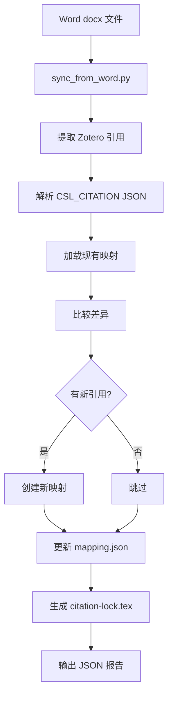
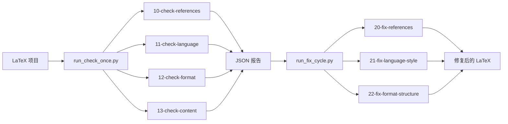
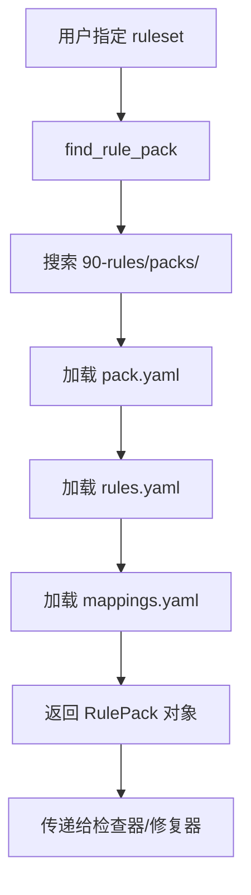

# Thesis Skills 技术架构

## 概述

Thesis Skills 采用模块化、可扩展的架构设计，核心目标是解决 Word → LaTeX 论文迁移过程中的文献引用管理问题，并提供可配置的检查和修复工作流。

## 核心设计理念

### 1. 确定性工作流
- **检查器（Checkers）**：只输出结构化 JSON 报告，不修改文件
- **修复器（Fixers）**：读取报告，做最小化修改
- **单向数据流**：检查 → 报告 → 修复，避免循环依赖

### 2. 引用映射持久化
- **Zotero key ↔ LaTeX ref 映射**：保存在 `ref/citation-mapping.json`
- **引用锁文件**：`citation-lock.tex` 使用 `\nocite{}` 锁定编号
- **删除语义**：删除引用时保留 bib 条目，保持编号稳定

### 3. YAML 驱动规则包
- **规则定义**：所有检查规则用 YAML 定义
- **Starter Pack**：提供可复制的模板
- **可扩展性**：新学校/期刊只需复制 Starter Pack 并修改规则

## 模块架构

```
thesis-skills/
├── core/                           # 核心模块
│   ├── zotero_extract.py          # Zotero 引用提取
│   ├── citation_mapping.py        # 引用映射管理
│   ├── project.py                 # 项目结构发现
│   ├── checkers.py                # 检查器基础框架
│   ├── fixers.py                  # 修复器基础框架
│   ├── reports.py                 # 报告生成
│   ├── rules.py                   # 规则加载
│   ├── yamlish.py                 # YAML 解析器
│   ├── migration.py               # 迁移工具
│   └── pack_generator.py          # 规则包生成器
│
├── 00-bib-zotero/                  # Zotero 工作流
│   ├── check_bib_quality.py       # BibTeX 质量检查
│   ├── sync_from_word.py          # Word → LaTeX 同步
│   └── THESIS_BIB_ZOTERO.md       # 技能文档
│
├── 01-word-to-latex/               # Word 迁移工作流
│   └── migrate_project.py         # 项目迁移
│
├── 10-check-*/                     # 确定性检查器
│   ├── check_references.py        # 引用完整性
│   ├── check_language.py          # 语言检查
│   ├── check_format.py            # 格式检查
│   └── check_content.py           # 内容检查
│
├── 20-fix-*/                       # 安全修复器
│   ├── fix_references.py          # 引用修复
│   ├── fix_language_style.py      # 语言风格修复
│   └── fix_format_structure.py    # 格式结构修复
│
├── 90-rules/                       # 规则包系统
│   ├── create_pack.py             # 创建规则包
│   ├── create_draft_pack.py       # 从材料生成规则包
│   └── packs/                     # 规则包目录
│       ├── university-generic/    # 通用大学论文 Starter Pack
│       ├── journal-generic/       # 通用期刊 Starter Pack
│       └── tsinghua-thesis/       # 清华大学论文 Pack（示例）
│
├── adapters/intake/                # 接入指南
│   └── README.md                  # 上传材料说明
│
├── run_check_once.py               # 一键检查
├── run_fix_cycle.py                # 一键修复
└── examples/                       # 示例项目
```

## 数据流

### Word → LaTeX 同步流程



### 检查和修复流程



### 规则包加载流程



## 核心模块详解

### Zotero 引用提取（core/zotero_extract.py）

**功能**：
- 从 Word docx 文件中提取内嵌的 Zotero 引用
- 解析 CSL_CITATION JSON 对象
- 提取引用元数据（作者、标题、年份等）

**关键数据结构**：
```python
@dataclass
class ZoteroCitation:
    zotero_key: str          # Zotero citation-key
    item_data: dict          # 引用元数据
    position: int            # 在文档中的位置
```

**实现细节**：
- 使用 zipfile 解压 docx 文件
- 用正则表达式提取 `w:instrText` 元素
- 字符串感知的 JSON 解析（处理字符串中的嵌套花括号）

### 引用映射管理（core/citation_mapping.py）

**功能**：
- 维护 Zotero key ↔ LaTeX ref 的双向映射
- 自动分配新的 ref 编号（ref001, ref002, ...）
- 生成 citation-lock.tex 内容

**关键数据结构**：
```python
@dataclass
class CitationMapping:
    root: Path
    mapping_file: Path
    mappings: dict[str, str]  # zotero_key -> latex_key
    next_ref_number: int      # 下一个可用的 ref 编号
```

**引用锁机制**：
```latex
% citation-lock.tex 自动生成
% Do not edit manually
\nocite{ref001,ref002,ref003,...}
```

这确保：
- 所有 bib 条目都会出现在参考文献列表中
- 即使某些引用没有被显式引用
- 引用编号始终保持稳定

### 项目发现（core/project.py）

**功能**：
- 自动发现 LaTeX 项目的主文件
- 扫描章节文件
- 定位参考文献文件
- 确定报告输出目录

**配置来源**：
```yaml
# rules.yaml
project:
  main_tex_candidates: [thuthesis-example.tex, thesis.tex, main.tex]
  chapter_globs: [chapters/*.tex, data/chap*.tex]
  bibliography_files: [ref/refs.bib, ref/refs-import.bib]
```

### 检查器框架（core/checkers.py）

**设计原则**：
1. **只检查，不修改**：检查器不应修改任何文件
2. **结构化输出**：统一输出 JSON 报告
3. **YAML 驱动**：检查规则从规则包加载

**报告格式**：
```json
{
  "checker": "check_references",
  "ruleset": "tsinghua-thesis",
  "issues": [
    {
      "type": "missing_key",
      "severity": "error",
      "location": "chapters/introduction.tex:15",
      "message": "Citation key 'ref999' not found in bibliography"
    }
  ],
  "summary": {
    "error_count": 1,
    "warning_count": 0,
    "info_count": 0
  }
}
```

### 修复器框架（core/fixers.py）

**设计原则**：
1. **读取报告**：修复器只读取检查报告
2. **最小修改**：只做必要的修改
3. **可逆操作**：支持 dry-run 预览

**修复策略**：
- 基于 `difflib` 生成 unified diff
- 支持原子性操作（要么全部应用，要么全部回滚）
- 生成修复报告记录所有更改

## 规则包系统

### 规则包结构

```
90-rules/packs/{pack-id}/
├── pack.yaml      # 规则包元数据
├── rules.yaml     # 检查规则定义
└── mappings.yaml  # 文件映射规则
```

### pack.yaml

```yaml
id: tsinghua-thesis              # 规则包唯一标识
kind: university-thesis          # 类型：university-thesis 或 journal
display_name: Tsinghua Graduate Thesis Pack
version: 1
precedence: guide_over_template  # 指南优先级高于模板
starter: false                   # 是否为 Starter Pack
```

### rules.yaml

```yaml
project:
  # 项目结构配置
  main_tex_candidates: [thuthesis-example.tex, thesis.tex, main.tex]
  chapter_globs: [chapters/*.tex, data/chap*.tex]
  bibliography_files: [ref/refs.bib, ref/refs-import.bib]

reference:
  # 引用检查规则
  missing_key:
    severity: error
  orphan_entry:
    severity: warning
  duplicate_title:
    severity: warning

  bib_quality:
    require_langid: true
    allowed_entry_types: [article, book, inproceedings, misc, phdthesis, mastersthesis, online]
    missing_langid:
      severity: warning
    malformed_doi:
      severity: warning

language:
  # 语言检查规则
  cjk_latin_spacing:
    enabled: true
    severity: warning
  repeated_punctuation:
    enabled: true
    severity: error
  weak_phrases:
    enabled: true
    severity: info
    patterns: [众所周知, 不难看出, 本文将]

format:
  # 格式检查规则
  require_list_of_figures: true
  require_list_of_tables: true
  figure_requires_centering: true

content:
  # 内容检查规则
  required_sections: [Introduction, Methods]
  abstract_keywords:
    min: 3
    max: 8
```

### 规则包创建工具

**create_pack.py**：从 Starter Pack 创建新规则包
```bash
python 90-rules/create_pack.py \
  --pack-id my-university \
  --display-name "My University Thesis" \
  --starter university-generic \
  --kind university-thesis
```

**create_draft_pack.py**：从上传材料生成 Draft Pack
```bash
python 90-rules/create_draft_pack.py \
  --intake adapters/intake/example-intake.json
```

## 一键运行器

### run_check_once.py

**功能**：
- 按顺序运行所有检查器
- 汇总所有报告
- 生成运行摘要

**执行流程**：
1. 加载规则包
2. 发现项目结构
3. 运行 BibTeX 质量检查
4. 运行引用检查
5. 运行语言检查
6. 运行格式检查
7. 运行内容检查
8. （可选）编译 LaTeX
9. 生成摘要报告

### run_fix_cycle.py

**功能**：
- 读取检查报告
- 按顺序运行修复器
- 支持多轮修复（直到没有问题或达到上限）
- 生成修复摘要

**执行流程**：
1. 加载规则包
2. 发现项目结构
3. 运行检查器
4. 检查是否有问题
5. 如果有且 --apply=true：运行修复器
6. 重新检查
7. 重复 3-6 直到没有问题或达到上限
8. 生成修复报告

## 技术栈

- **Python 3.8+**：仅使用标准库
- **Markdown**：技能文档格式
- **YAML**：规则定义格式
- **JSON**：报告格式
- **unittest**：测试框架

**设计原则**：
- **零依赖**：核心模块只使用 Python 标准库
- **可移植**：可在任何有 Python 3 的环境中运行
- **可测试**：每个模块都有对应的单元测试

## 扩展指南

### 添加新的检查器

1. 在 `10-check-*/` 目录创建新模块
2. 继承检查器基类或实现检查逻辑
3. 在 `rules.yaml` 中添加对应规则
4. 在 `run_check_once.py` 中注册

### 添加新的修复器

1. 在 `20-fix-*/` 目录创建新模块
2. 实现读取报告、生成修复、应用修复的逻辑
3. 在 `run_fix_cycle.py` 中注册
4. 确保支持 dry-run 模式

### 添加新的规则包

1. 复制最近的 Starter Pack
2. 修改 `pack.yaml` 中的元数据
3. 根据学校/期刊要求修改 `rules.yaml`
4. （可选）添加 `mappings.yaml` 定义文件映射
5. 运行示例项目验证规则

## 测试策略

### 单元测试
- 每个核心模块都有对应的测试文件
- 测试覆盖边界条件和错误处理

### 集成测试
- `examples/minimal-latex-project/` 提供端到端测试环境
- 验证完整的检查和修复流程

### 回归测试
- 确保新功能不会破坏现有功能
- 使用 git hooks 在提交前运行测试

## 性能考虑

- **增量处理**：Zotero 同步只处理新增/删除的引用
- **懒加载**：规则包按需加载
- **缓存机制**：项目发现结果可复用
- **并行执行**：独立的检查器可并行运行（未来支持）

## 安全性

- **不直接执行用户代码**：所有脚本都在沙箱中运行
- **文件操作原子性**：修改前先备份
- **dry-run 模式**：所有破坏性操作都支持预览
- **权限最小化**：只读写必要的文件

## 未来规划

### v1.3.0 计划
- 支持更多参考文献管理工具（Mendeley、EndNote）
- 添加更多语言检查规则
- 改进错误提示和修复建议

### v2.0.0 愿景
- Web UI 界面
- 实时协作支持
- 云端规则包仓库
- AI 辅助修复建议

## 参考资源

- **项目主页**：https://github.com/quzhiii/thesis-skills
- **技术路线图**：`docs/plans/2026-03-09-thesis-skills-restructure.md`
- **接入指南**：`adapters/intake/README.md`
- **示例项目**：`examples/minimal-latex-project/`
