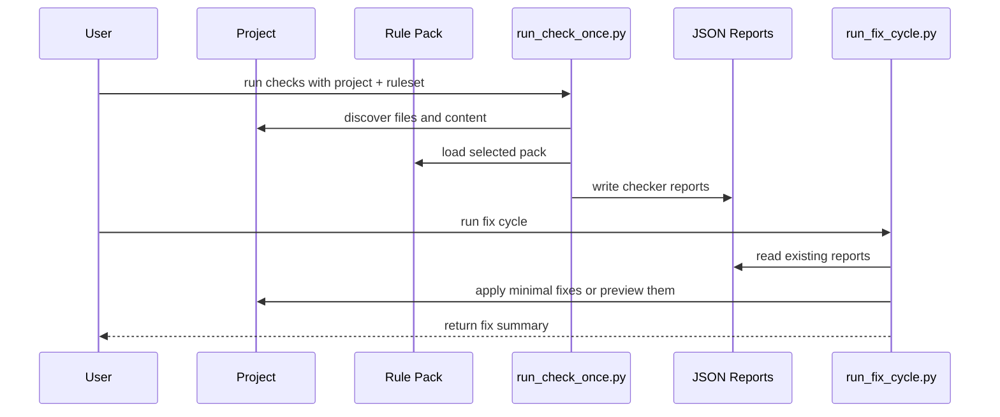

# Architecture

## Overview

`thesis-skills` is organized around one guiding idea: academic writing workflows become more reliable when migration, policy, checking, and fixing are separated into distinct layers.

The repository therefore uses four major layers:

1. Intake and migration
2. Rule-pack definition
3. Deterministic checking
4. Report-driven fixing

## Layer 1: Intake and Migration

Relevant paths:

- `adapters/intake/`
- `01-word-to-latex/`
- `core/migration.py`

This layer accepts uploaded materials or exported assets and turns them into a normalized LaTeX-project view.

Important contracts:

- `example-intake.json` - uploaded-material metadata for draft-pack generation
- `migration.json` - explicit asset mapping for Word-to-LaTeX migration

Migration is explicit. The repository does not guess file intent solely from filenames. It uses:

- `document_metadata`
- `word_style_mappings`
- `chapter_role_mappings`
- explicit file mappings

## Layer 2: Rule Packs

Relevant paths:

- `90-rules/packs/`
- `core/rules.py`
- `core/yamlish.py`

Each ruleset lives in its own pack directory and contains:

- `pack.yaml` - identity and scope metadata
- `rules.yaml` - checker-facing policy
- `mappings.yaml` - source-template and role mapping information
- optional `draft-notes.md` - manual follow-up notes for new packs

Starter packs currently included:

- `tsinghua-thesis`
- `university-generic`
- `journal-generic`

## Layer 3: Deterministic Checking

Relevant paths:

- `run_check_once.py`
- `00-bib-zotero/`
- `10-check-references/`
- `11-check-language/`
- `12-check-format/`
- `13-check-content/`
- `core/checkers.py`

The check stage is intentionally deterministic. It reads a project plus a ruleset and emits JSON reports.

Current checks include:

- bibliography quality
- missing citation keys and orphan bibliography entries
- CJK/Latin spacing and repeated punctuation
- figure/table captions, labels, and broken refs
- required sections and abstract keyword counts

## Layer 4: Report-Driven Fixing

Relevant paths:

- `run_fix_cycle.py`
- `20-fix-references/`
- `21-fix-language-style/`
- `22-fix-format-structure/`
- `core/fixers.py`

Fixers consume reports rather than re-reading the entire project with unconstrained reasoning.

That keeps them:

- safer
- easier to explain
- easier to test
- easier to limit to minimal edits

## Pack Lifecycle

## Check/Fix Sequence

## Runners

### `run_check_once.py`

Responsibilities:

- discover the project
- load the chosen pack
- run all deterministic checks
- write `run-summary.json`

### `run_fix_cycle.py`

Responsibilities:

- read previously generated reports
- call safe fixers
- write `fix-summary.json`

## Draft Pack Flow

Relevant paths:

- `90-rules/create_pack.py`
- `90-rules/create_draft_pack.py`
- `core/pack_generator.py`

Two entrypoints exist:

- `create_pack.py` - copy from a starter and rename it
- `create_draft_pack.py` - scaffold a pack directly from uploaded-material metadata

The draft path is intentionally conservative. It creates a structured starting point, not a final authoritative ruleset.

## Extension Boundary

The intended extension model is:

- new school or journal -> new pack under `90-rules/packs/`
- new asset source -> new intake contract or migration helper
- new mechanical check -> new deterministic checker
- new safe remediation -> new fixer driven by report codes

The main runners should stay orchestration-focused.

## Verification Model

The repository is validated by:

- regression tests in `tests/`
- runnable examples in `examples/`
- one-click runner verification

The design goal is not only to produce outputs, but to make those outputs easy to verify and reason about.
